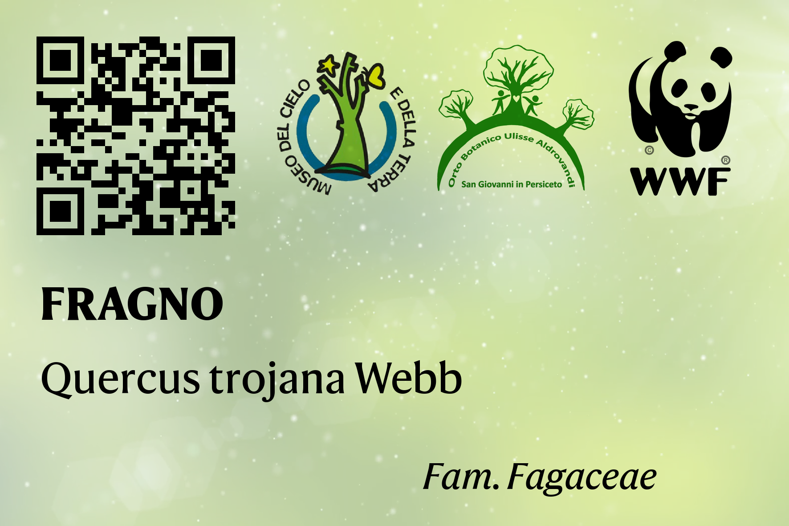
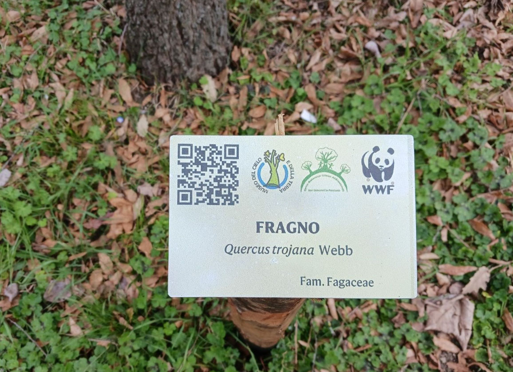

# qrsigns
Scripts to generate multiple images with associated QR code using data stored in a .csv file

## `qrsigns_SGP.py`
This script was used to generate ~200 garden signs for the Botanical Garden in San Giovanni in Persiceto (BO). This project is in collaboration with local WWF volunteers who installed the QR garden signs in February 2023.

Here is an example (with its practical application):

</img>
</img>